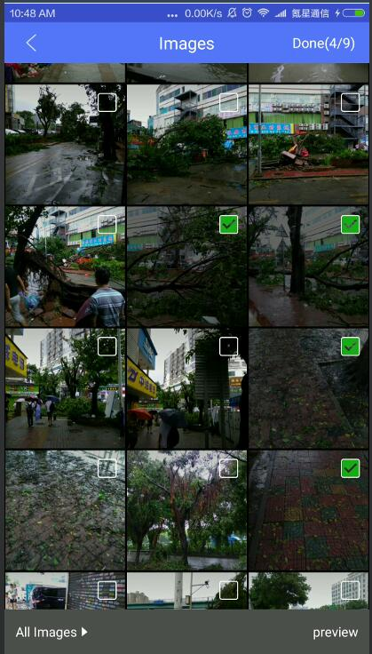
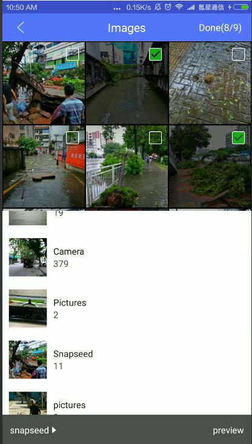
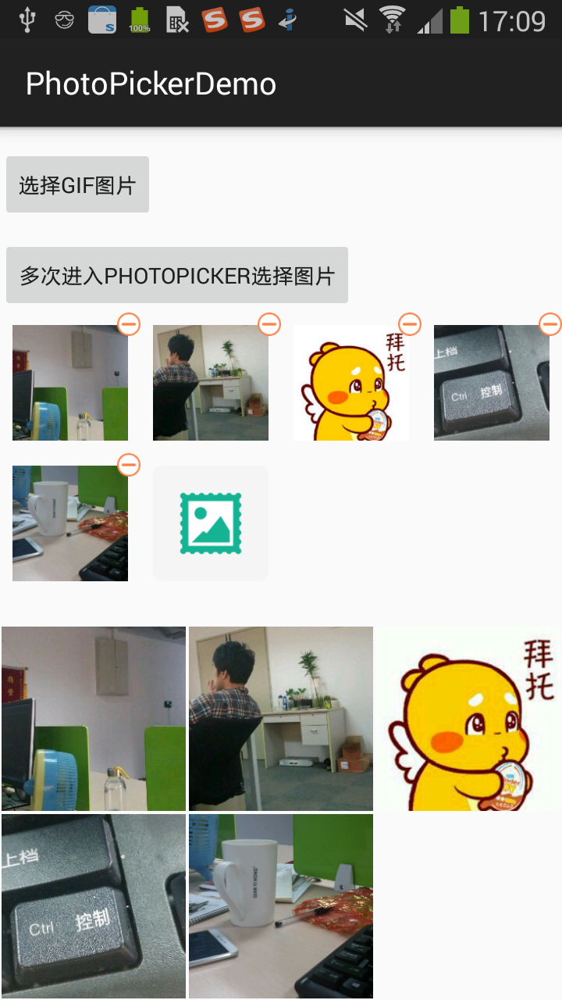

在原版的基础上增加了在Fragment中的调用，在参数中直接填写图片数量。
解决了原版在删除图片后路径未删除的BUG。
由于本人想增加上选取图片后压缩上传的功能，所以就不提交到原版的库里了。喜欢原版的可自己去查看。
原版地址：[Photopicker](https://github.com/glassLake/PhotoPicker)


# 效果图
 


文件夹切换：底部弹窗


 


图片预览：

 


封装好的图片显示组件:(上方是图片选择,下面是只显示图片的组件)

 


---

# Usage

### gradle

Add it in your root build.gradle at the end of repositories:

	allprojects {
		repositories {
			...
			maven { url "https://jitpack.io" }
		}
	}
Step 2. Add the dependency

	dependencies {
	        compile 'aom.andan:photopicker:1.0.0'
	}


## 使用完全封装好的组件


xml:

```
<me.iwf.photopicker.widget.MultiPickResultView
    android:layout_width="match_parent"
    android:layout_height="wrap_content"
    android:id="@+id/recycler_view"/>
```

选择图片并显示图片:

```
recyclerView = (MultiPickResultView) findViewById(R.id.recycler_view);
recyclerView.init(this,MultiPickResultView.ACTION_SELECT,null);

//onActivityResult里一行代码回调
 recyclerView.onActivityResult(requestCode,resultCode,data);
```


只显示图片

```
//可以初始化时传入地址
recyclerViewShowOnly.init(this,MultiPickResultView.ACTION_ONLY_SHOW,pathslook);

//也可以后续设置地址:
 recyclerViewShowOnly.showPics(pathslook);
```


## 不使用显示组件,只使用选择图片的功能

### Pick Photo

```java
PhotoPickUtils.startPick(this);
```

### 

### onActivityResult
```java
 @Override protected void onActivityResult(int requestCode, int resultCode, Intent data) {
    super.onActivityResult(requestCode, resultCode, data);
    PhotoPickUtils.onActivityResult(requestCode, resultCode, data, new 		PhotoPickUtils.PickHandler() {
      @Override
      public void onPickSuccess(ArrayList<String> photos) {//已经预先做了null或size为0的判断
       
      }

      @Override
      public void onPickFail(String error) {
        Toast.makeText(MainActivity.this,error,Toast.LENGTH_LONG).show();
      }

      @Override
      public void onCancle() {
        Toast.makeText(MainActivity.this,"取消选择",Toast.LENGTH_LONG).show();
      }
    });
```

### manifest
```xml
<manifest xmlns:android="http://schemas.android.com/apk/res/android"
    >
  <uses-permission android:name="android.permission.WRITE_EXTERNAL_STORAGE"/>

  <application
    ...
    >
    ...
    
    <activity android:name="me.iwf.photopicker.PhotoPickerActivity"
      android:theme="@style/customTheme" 
       />

    <activity android:name="me.iwf.photopicker.PhotoPagerActivity"
      android:theme="@style/customTheme"/>
    
  </application>
</manifest>
```
### Custom style
```xml
<style name="customTheme" parent="Theme.AppCompat.Light.NoActionBar">
  <item name="colorPrimary">#FFA500</item>//标题栏背景色
  <item name="colorPrimaryDark">#CCa500</item>
</style>
```


## Proguard

```
# Glide
-keep public class * implements com.bumptech.glide.module.GlideModule
-keep public enum com.bumptech.glide.load.resource.bitmap.ImageHeaderParser$** {
    **[] $VALUES;
    public *;
}
# nineoldandroids
-keep interface com.nineoldandroids.view.** { *; }
-dontwarn com.nineoldandroids.**
-keep class com.nineoldandroids.** { *; }
# support-v7-appcompat
-keep public class android.support.v7.widget.** { *; }
-keep public class android.support.v7.internal.widget.** { *; }
-keep public class android.support.v7.internal.view.menu.** { *; }
-keep public class * extends android.support.v4.view.ActionProvider {
    public <init>(android.content.Context);
}
# support-design
-dontwarn android.support.design.**
-keep class android.support.design.** { *; }
-keep interface android.support.design.** { *; }
-keep public class android.support.design.R$* { *; }
```

---

# Thanks 

[Photopicker](https://github.com/donglua/PhotoPicker)
[Photopicker](https://github.com/glassLake/PhotoPicker)
